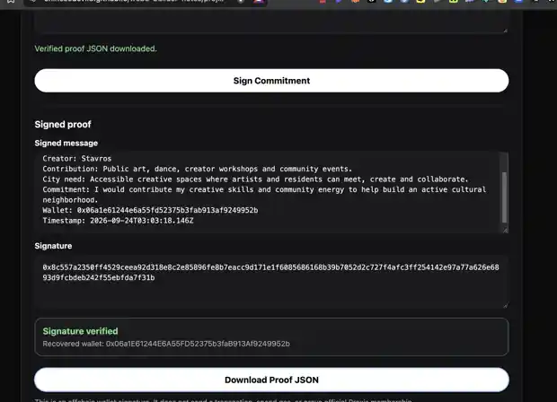

# Praxis Creator Commitment

## Goal

Build a small creator-focused companion app around Praxis's public city-building direction.

The app will let a creator describe what they can contribute to a future city or neighborhood, connect a browser wallet, sign that commitment, verify the signature in the browser, and export a public proof artifact.

## Why this project

Praxis does not currently expose a public programmable blockchain/testnet or official smart-contract integration that can be verified and used like the other chain-native projects in this repository.

Instead of inventing an onchain deployment, this project stays honest about the available surface and builds around a real Praxis community/city-building use case.

## Planned flow

1. Creator fills in a short contribution profile.
2. Wallet connects in the browser.
3. The app generates a deterministic commitment message.
4. The creator signs the message with the browser wallet.
5. The app verifies the signature locally.
6. The app exports a JSON proof containing the message, signer address, signature, and timestamp.
7. The repository documents the demo, proof, screenshots, and Praxis references.

## Creator angle

The first example will focus on creative/community contribution such as:

- public art and graffiti
- dance and movement sessions
- creator workshops
- community events
- shared creative spaces

## Project principles

- No private keys or seed phrases
- Browser-wallet signing only
- No invented Praxis RPCs, contracts, or chain details
- No claim of official Praxis affiliation
- Public source, reproducible demo, and verifiable proof
- Keep the project simple enough to explain clearly

## Status

- [x] Project scope defined
- [x] Commitment schema
- [x] Browser UI
- [x] Wallet connect implemented
- [x] Message signing implemented
- [x] Signature verification implemented and verified with a real wallet
- [x] JSON proof export implemented and verified
- [x] Real browser verification proof recorded
- [x] Final README cleanup
- [x] Showcase update

## Disclaimer

This is an independent community prototype inspired by publicly available Praxis materials. It is not an official Praxis product, application, or blockchain integration.

## Browser test status

Complete. A real browser-wallet `personal_sign` flow was executed on the live GitHub Pages app. The signature was recovered locally, matched to the connected wallet, and exported as a verified JSON proof artifact.

## Live demo

https://chinesedevil3.github.io/web3-builder-notes/projects/praxis/

## Verified browser proof

On 2026-09-24, the live app successfully completed a real browser-wallet `personal_sign` flow and locally recovered the signing wallet as `0x06a1E61244E6A55FD52375b3faB913Af9249952b`. The recovered address matched the connected signer and the UI returned **Signature verified**. See `proof/2026-09-24-wallet-signature.md`.

## Exported proof artifact

The live app exported a verified proof JSON after a real browser-wallet signature:

- `proof/praxis-creator-commitment-2026-09-24.json`
- `verified: true`
- signer/recovered wallet: `0x06a1E61244E6A55FD52375b3faB913Af9249952b`
- timestamp: `2026-09-24T03:03:18.146Z`

The artifact contains the exact signed message and signature, allowing the commitment proof to be independently inspected rather than relying only on a screenshot.

## What this footprint proves

This project is not presented as a Praxis onchain deployment. It demonstrates a real, public Praxis-oriented creator tool built around the ecosystem surface that is actually available: a live browser app, wallet-based creator commitment, cryptographic signature recovery, reproducible verification, and a public proof artifact.

The important part of the footprint is the honesty of the integration: no invented Praxis RPC, contract, testnet, or transaction is claimed.

## Completion

**Status: Complete — 2026-09-24**

Final flow tested:

`Live app → Connect Wallet → Sign Commitment → Recover signer → Signature verified → Download Proof JSON → Public GitHub proof`

## Visual proof

The screenshot shows the signed commitment message, raw signature, **Signature verified**, recovered wallet, and the enabled **Download Proof JSON** action on the live app.
